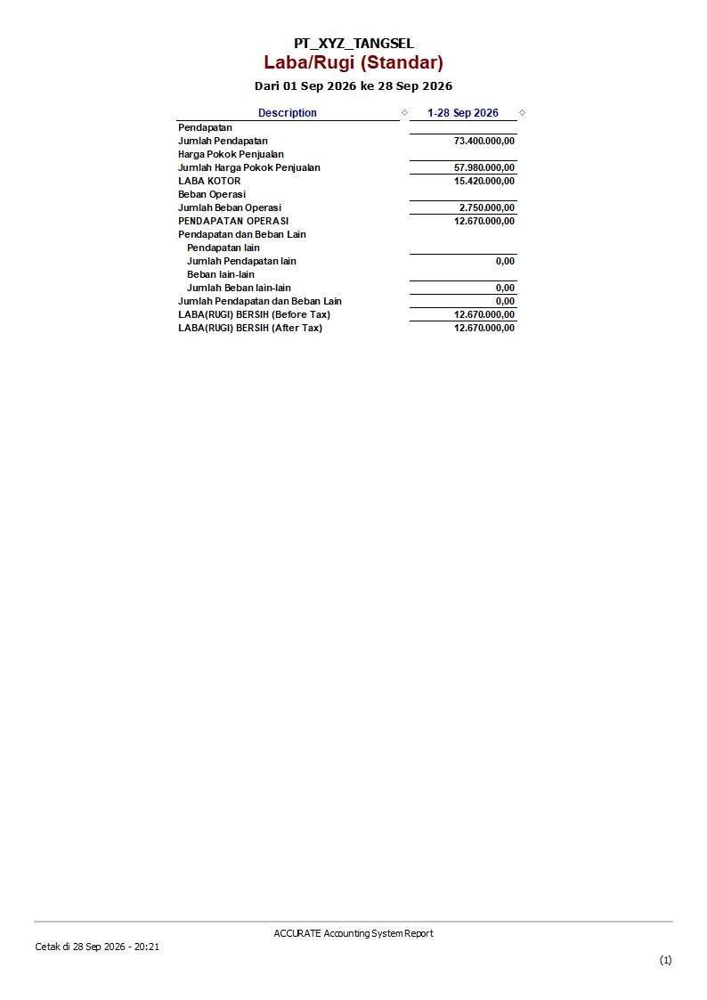

# Accurate 5 Standard Desktop — Accounting Project

## 📌 Project Overview

Project simulasi pengelolaan akuntansi dan keuangan menggunakan **Accurate 5 Standard Desktop**.

Project ini mencakup setup perusahaan, pengelolaan master data, transaksi pembelian dan penjualan, pengelolaan persediaan menggunakan metode FIFO, pencatatan piutang, beban operasional, hingga penyusunan laporan keuangan.

---

## 🏢 Company Information

* **Company:** PT_XYZ_TANGSEL
* **Periode:** 01 September 2026 – 31 Desember 2026
* **Currency:** IDR
* **Inventory Method:** FIFO
* **Software:** Accurate 5 Standard Desktop

### 1. Informasi Perusahaan

---

## ⚙️ Master Data

### 2. Daftar Akun

### 3. Daftar Barang

---

## 🛒 Purchasing

### 4. Transaksi Pembelian

---

## 💰 Sales

### 5. Transaksi Penjualan

---

## 📊 Financial Reports

### 6. Neraca Saldo

### 7. Laporan Laba Rugi

### 8. Neraca Final

---

## 📈 Final Result

| Financial Information |           Amount |
| --------------------- | ---------------: |
| Penjualan             |     Rp73.400.000 |
| HPP                   |     Rp57.980.000 |
| Laba Kotor            |     Rp15.420.000 |
| Beban Operasional     |      Rp2.750.000 |
| **Laba Bersih**       | **Rp12.670.000** |
| Piutang Usaha         |     Rp43.400.000 |
| Persediaan Akhir      |     Rp25.420.000 |
| **Total Aset**        | **Rp68.820.000** |

### Balance Check

**Total Aset = Rp68.820.000**

**Total Liabilitas + Ekuitas = Rp68.820.000**

✅ **Balanced**

---

## 🎯 Skills Demonstrated

* Accurate 5 Standard Desktop
* Accounting & Financial Recording
* Chart of Accounts Management
* Purchasing & Sales Transactions
* Accounts Receivable Management
* Inventory Management
* FIFO Inventory Method
* Cost of Goods Sold (COGS/HPP)
* Financial Reporting
* Basic Accounting Analysis

---

## 📝 Note

Project ini merupakan **simulasi pembukuan perusahaan** yang dibuat sebagai project pembelajaran dan portfolio untuk mendemonstrasikan penggunaan Accurate 5 Standard Desktop serta pemahaman terhadap alur dasar transaksi dan laporan keuangan.
