## 🖼️ Project Documentation

### 1. Company Setup

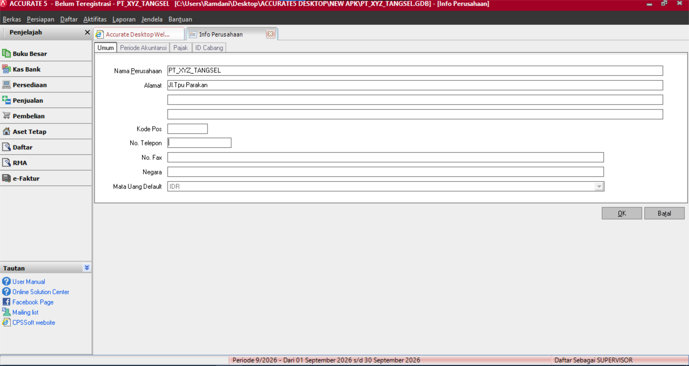

### 2. Chart of Accounts

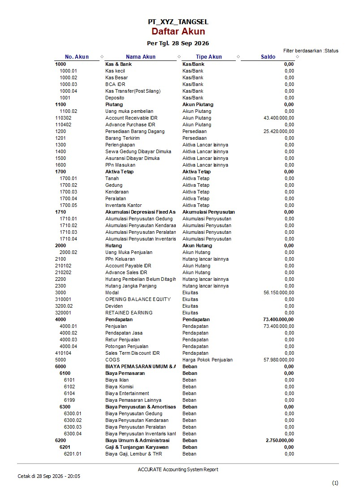
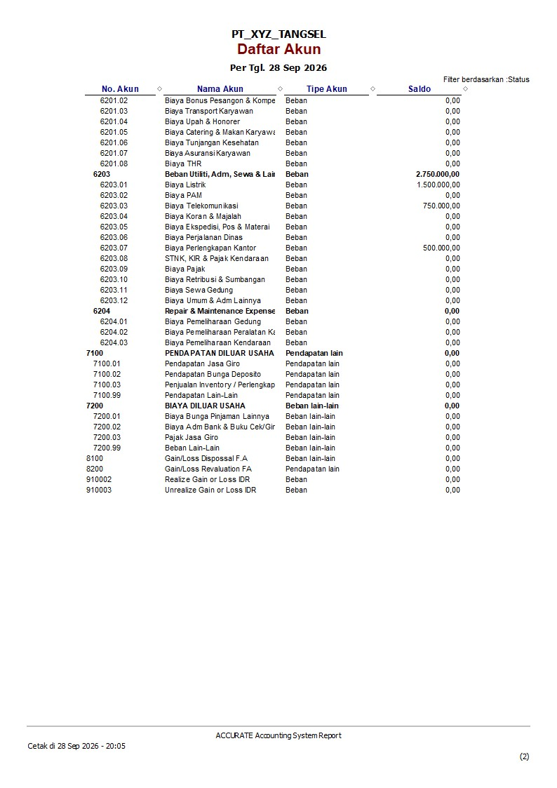

### 3. Master Barang

### 4. Faktur Pembelian

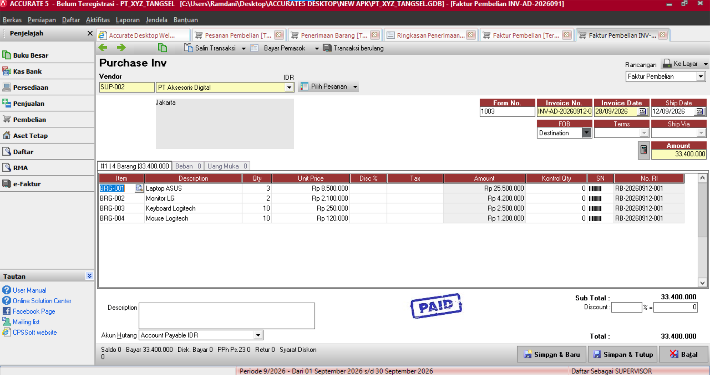

### 5. Faktur Penjualan

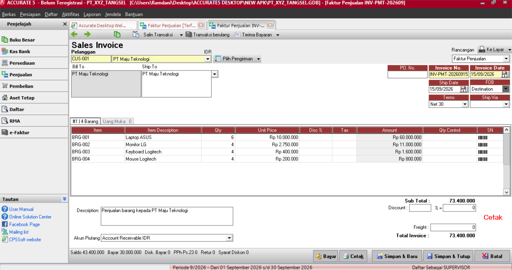

### 6. Neraca Saldo Final

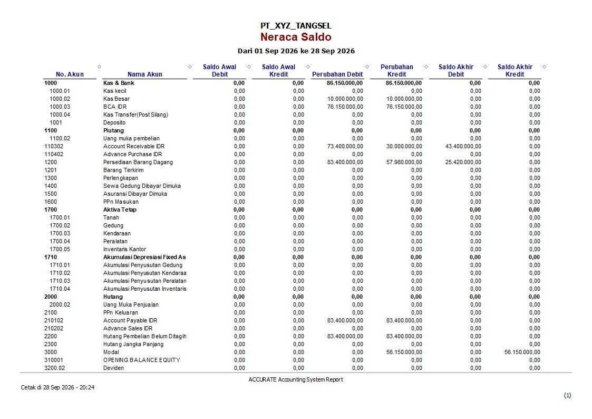
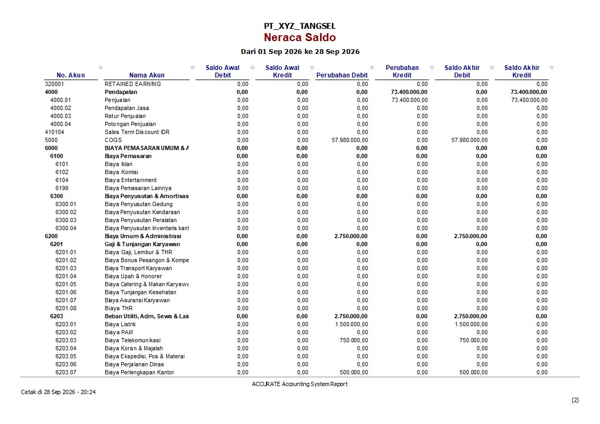
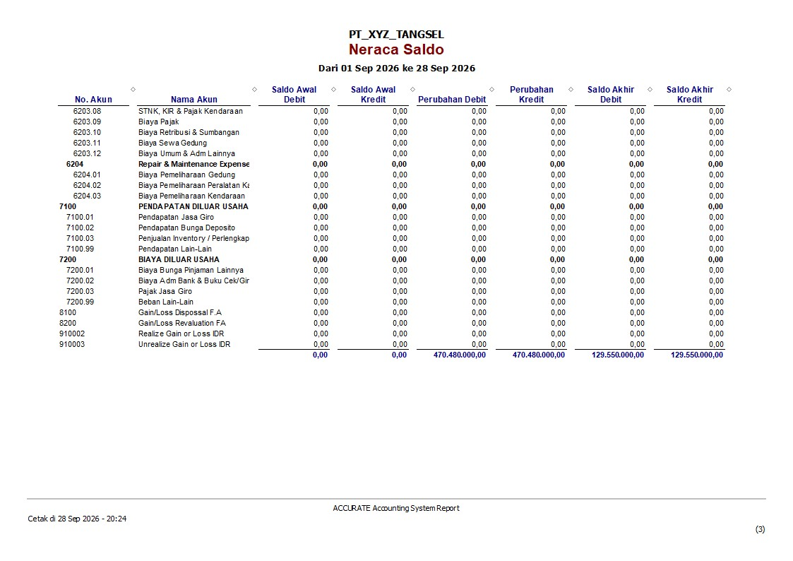

### 7. Laporan Laba Rugi

### 8. Neraca Final

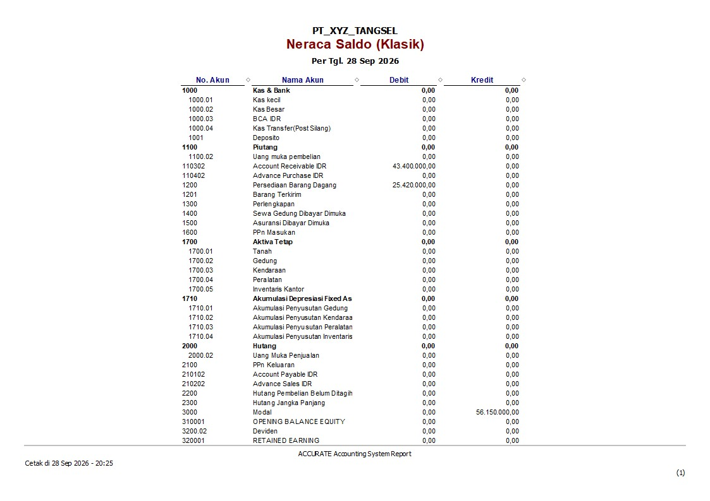
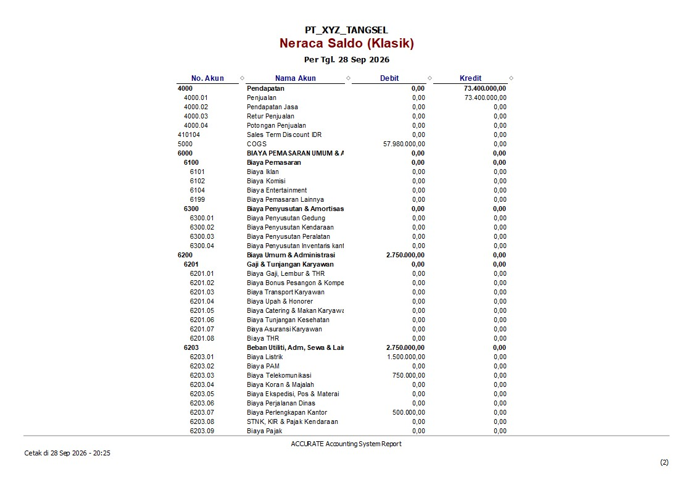
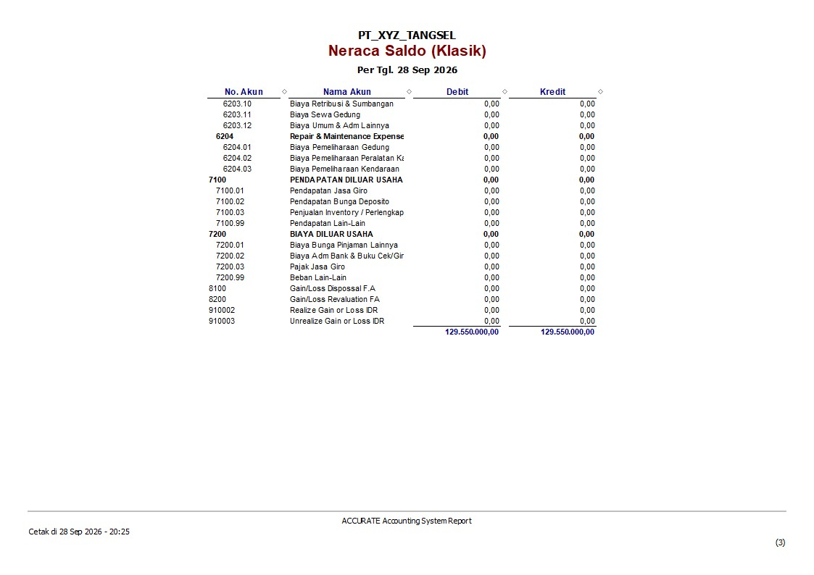

